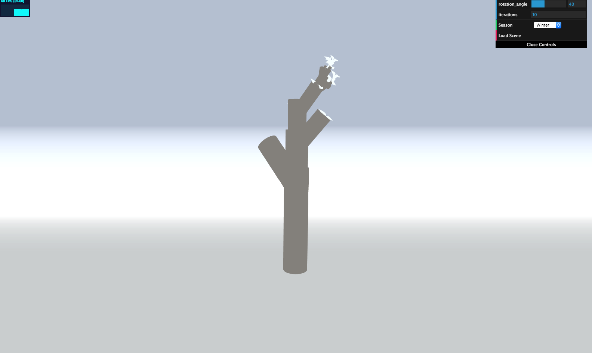

CIS 566 Homework 4: L Systems
=====================================

Written by Julia Chun (hyojchun)

Project Results
----------------
### Inspiration

A published demo can be found here : https://hjchun96.github.io/hw04-l-systems/

Below is the final image generated by the code:
Winter   				     | Summer    			         | Fall   		       |
:-------------------:|:----------------------:|:-------------------:
 | ||

The scene was inspired by the look below, which depicts a tree with leaves covered in snow.

Implementation Details
----------------------
### L Systems
* `Lsystem` holds most logic, including the functions outlining the drawing rule as well as expansion rule. This decision was made because
it was easier to bind functions as well as access turtle's core functionalities used in drawing. My L system is defined as the following:
`F`,`L`: Draw Branch and Leaf
`[`, `]`:Push and Pop
`+`,`-`: Rotate Right and Left
`*`: Turn around (rotating 180 degrees)
`^`, `~`: Angle up and down

* `ExpansionRule` contains the logic for selecting a rule for expansion, which is done probabilistically using a randomly generated number.
* `DrawingRule` only holds the rules dictionary and is just an empty shell class.
* `Turtle` holds the main functions used for drawing rules such as `rotate` and `moveForward`, and also maintains depth and position/orientation
information used for transformation matrix calculation.

### GUI
The user has control over the
* Angle of rotation, which controls both the angle around the up direction and right direction.
* Number of iterations, which decides how many times the grammar should be expanded.
* Season, which can be Winter, Summer, Fall, and this in turn changes the branch, leaf, and background color appropriately
to match the mood.

References & Resources
----------------------
* Transformations: http://www.cis.upenn.edu/~cis277/16sp/lectures/460transforms3d.html#slide-26
* For basic overview and refresher: https://cis700-procedural-graphics.github.io/files/lsystems_1_31_17.pdf, https://www.youtube.com/watch?v=E1B4UoSQMFw
